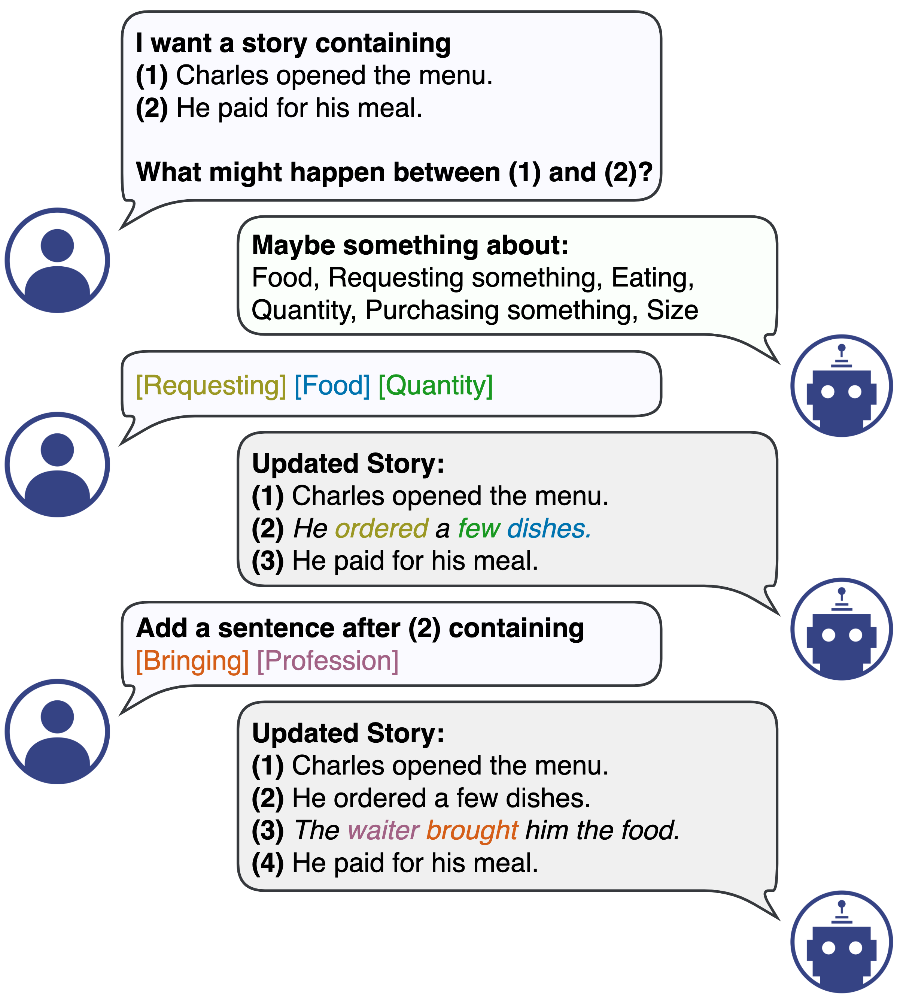
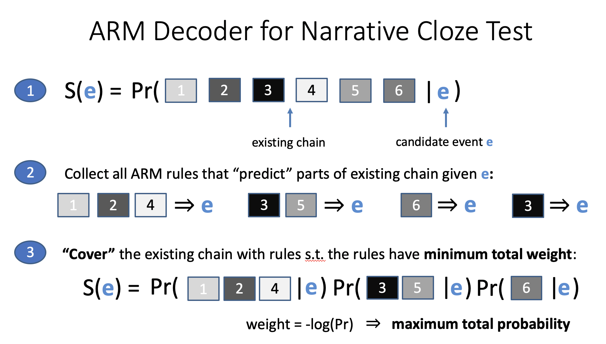
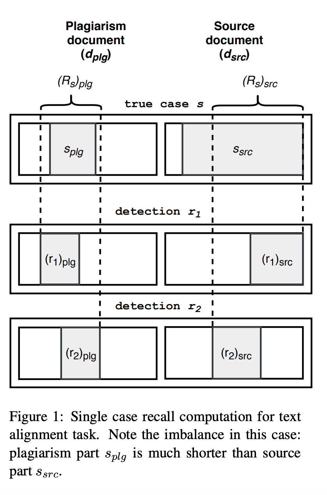
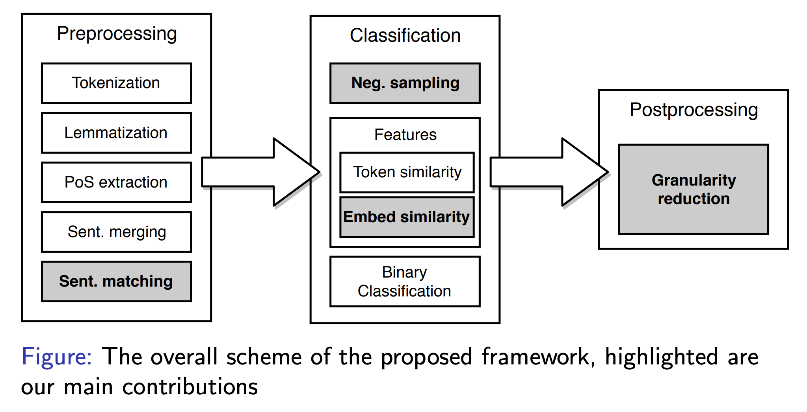
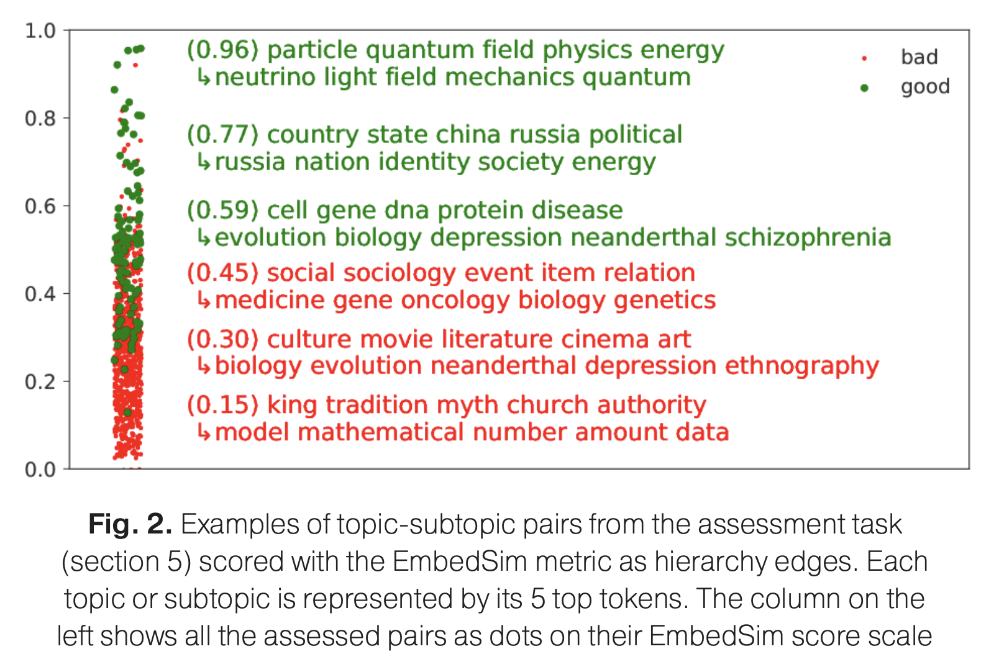
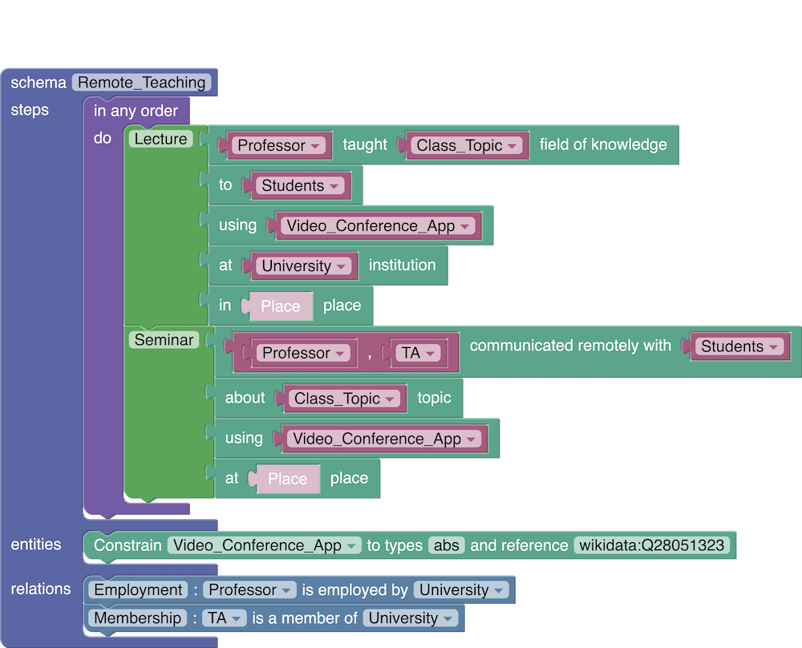
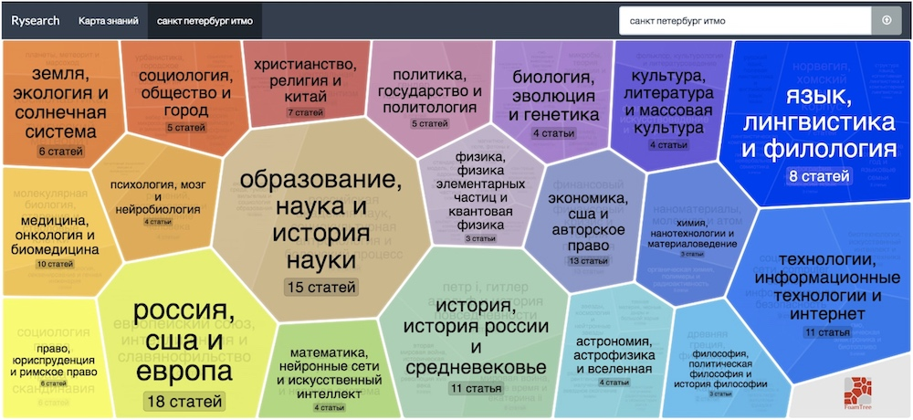
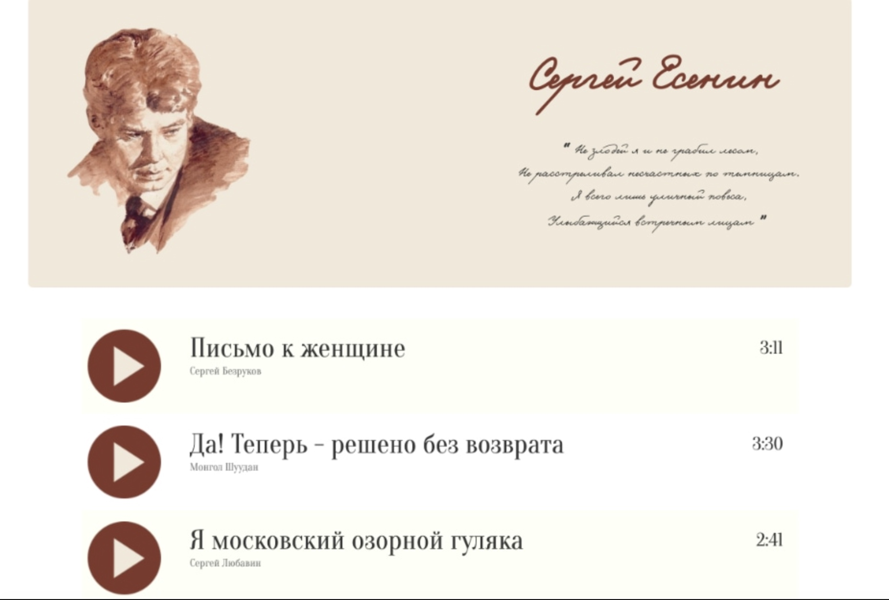
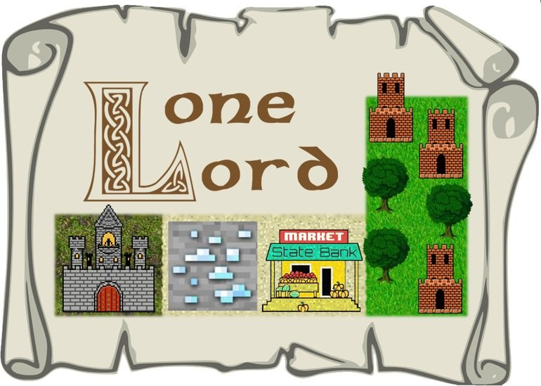

 | ru-RU: Антон Белый / zh-CN: 安东·别里 / IPA: [ɐn̪'t̪o̞n̪ 'bʲeɫɨç]    [abel@jhu.edu](mailto:abel@jhu.edu) / [Scholar](https://scholar.google.com/citations?user=okfWOCsAAAAJ) / [Github](https://github.com/AVBelyy/) / [LinkedIn](https://www.linkedin.com/in/anton-belyy-99704310b/)    natural language processing / machine learning / algorithms

## Hi, I'm Anton!
I am a 3rd year PhD student at the [Center of Language and Speech Processing](https://www.clsp.jhu.edu/) (CLSP) at Johns Hopkins University. I am fortunate to be advised by [Benjamin Van Durme](http://www.cs.jhu.edu/~vandurme/) and [Vladimir Braverman](http://www.cs.jhu.edu/~vova/).

I develop efficient algorithms for large-scale **information retrieval** and structured, semantically-aware **text generation**. I also **design interfaces** that allow humans and machines collaborate on generating structured objects such as **scripts** or **schemas**.        

My background is in Algorithms, Machine Learning and Software Development: prior to PhD, I interned at [JetBrains](https://www.jetbrains.com/), worked for a year as a Backend Developer at [VK](https://en.wikipedia.org/wiki/VK_(service)) and for two years as a Senior Data Scientist at [Tochka Bank](https://tochka.com/).
I received B.Sc. in Applied Maths and Computer Science from [ITMO University](https://en.itmo.ru/), where I've collaborated with [Andrey Filchenkov](https://scholar.google.ru/citations?user=ry63T9QAAAAJ&hl=en&oi=ao) and [Konstantin Vorontsov](https://scholar.google.ru/citations?user=KIW4fnsAAAAJ&hl=en&oi=ao) on building [exploratory search engines](https://github.com/AVBelyy/Rysearch) and [plagiarism detection tools](http://itmo.news/en/science/it/news/8440/).

## My papers

 | **InFillmore: Frame-Guided Language Generation with Bidirectional Context.**  Jiefu Ou, Nathaniel Weir, Anton Belyy, Felix Yu, and Benjamin Van Durme. Accepted to **\*SEM 2021.** | [[paper]](https://arxiv.org/abs/2103.04941) [[demo]](https://nlp.jhu.edu/demos/infillmore)
 | **Script Induction As Association Rule Mining.**  Anton Belyy and Benjamin Van Durme. **ACL Workshop on Narrative Understanding, Storylines, and Events 2020.** | [[paper]](https://www.aclweb.org/anthology/2020.nuse-1.7/) [[slides]](https://slideslive.com/38929746/script-induction-as-association-rule-mining) [[code]](https://github.com/AVBelyy/arm-nachos)
 | **Improved Evaluation Framework for Complex Plagiarism Detection.**  Anton Belyy, Marina Dubova, and Dmitry Nekrasov. **ACL 2018.** | [[paper]](http://www.aclweb.org/anthology/P18-2026) [[poster]](http://anthology.aclweb.org/attachments/P18-2026.Poster.pdf) [[code]](https://github.com/AVBelyy/normplagdet)
 | **Framework for Russian Plagiarism Detection Using Sentence Embedding Similarity and Negative Sampling.**  Anton Belyy and Marina Dubova. **Dialogue 2018.** | [[paper]](http://www.dialog-21.ru/media/4289/belyyav_dubovama.pdf) [[slides]](http://www.dialog-21.ru/media/4351/belyy_dubova.pdf) [[code]](https://github.com/AVBelyy/hack-the-plag-2017) 
 | **Quality Evaluation and Improvement for Hierarchical Topic Modeling.**  Anton Belyy, Mariia Seleznova, Alexey Sholokhov, and Konstantin Vorontsov. **Dialogue 2018.** | [[paper]](http://www.dialog-21.ru/media/4562/belyyavplusetal.pdf) [[slides]](http://www.dialog-21.ru/media/4352/belyy_seleznova.pdf) [[demo]](https://github.com/AVBelyy/Rysearch)

## Fun projects

My web-dev projects, written (mostly) on the rare occasions of having spare time, and mostly to play with a fancy new Web framework :)   

 | **SchemaBlocks** (2019 -- present)   A web-based UI for "programming" [KAIROS schemas](https://www.darpa.mil/program/knowledge-directed-artificial-intelligence-reasoning-over-schemas), specifying events, relations, and entity types. Based on [Google Blockly](https://github.com/google/blockly). | [[code]](http://github.com/AVBelyy/SchemaBlocks) [[demo]](http://sb.retloko.org)
 | **Rysearch** (2017 -- 2019)   An [explorato*ry* *search*](https://en.wikipedia.org/wiki/Exploratory_search) engine, that uses topic models to organize popular science literature into a hierarchical map and perform inexact document queries over this map. Based on [FoamTree](https://carrotsearch.com/foamtree/) and [hARTM](http://jmlda.org/papers/doc/2016/no2/Chirkova2016hARTM.pdf). | [[code]](http://github.com/AVBelyy/Rysearch) [[demo]](http://rysearch.retloko.org)
 | **Esenin** (2013)   A karaoke music player, featuring songs based on lyrics of a great 20th-century Russian poet [Sergey Esenin](https://en.wikipedia.org/wiki/Sergei_Yesenin). Written overnight from scratch in [CoffeeScript](https://coffeescript.org/). | [[code]](http://github.com/AVBelyy/esenin) [[demo]](http://esenin.retloko.org)
 | **Lonelord** (2013)   An online strategy game, where you can build castles, mine resources, wage wars and trade with neighbors... by sending MongoDB database queries! Inspired by [mysqlgame](https://news.ycombinator.com/item?id=5964816).  | [[code]](http://github.com/AVBelyy/lonelord) [[blog]](https://habr.com/ru/post/189614/) 
