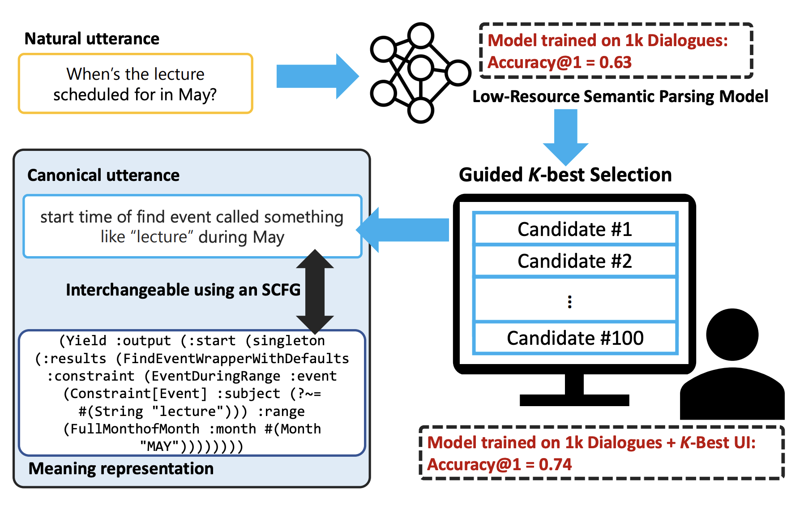

 | ru-RU: Антон Белый / zh-CN: 安东·别里 / IPA: [ɐn̪'t̪o̞n̪ 'bʲeɫɨç]    [Scholar](https://scholar.google.com/citations?user=okfWOCsAAAAJ) / [Github](https://github.com/AVBelyy/) / [LinkedIn](https://www.linkedin.com/in/anton-belyy-99704310b/)    natural language processing / machine learning / algorithms

## Hi, I'm Anton!
I am a 3rd year PhD student at the [Center of Language and Speech Processing](https://www.clsp.jhu.edu/) (CLSP) at Johns Hopkins University. I am fortunate to be advised by [Benjamin Van Durme](http://www.cs.jhu.edu/~vandurme/) and [Vladimir Braverman](http://www.cs.jhu.edu/~vova/).

I develop efficient algorithms for large-scale **similarity search** and semantically-aware **data mining**. I also **build annotation systems** that allow humans and machines to collaborate on labeling structured data such as **scripts** or **schemas**.

My background is in Algorithms, Machine Learning and Software Development: prior to PhD, I interned at [JetBrains](https://www.jetbrains.com/), worked for a year as a Backend Developer at [VK](https://en.wikipedia.org/wiki/VK_(service)) and for two years as a Senior Data Scientist at [Tochka Bank](https://tochka.com/).
I received B.Sc. in Applied Maths and Computer Science from [ITMO University](https://en.itmo.ru/), where I've collaborated with [Andrey Filchenkov](https://scholar.google.ru/citations?user=ry63T9QAAAAJ&hl=en&oi=ao) and [Konstantin Vorontsov](https://scholar.google.ru/citations?user=KIW4fnsAAAAJ&hl=en&oi=ao) on building [exploratory search engines](https://github.com/AVBelyy/Rysearch) and [plagiarism detection tools](http://itmo.news/en/science/it/news/8440/).

## Papers

 | **Human Schema Curation via Causal Association Rule Mining.** Noah Weber, Anton Belyy, Nils Holzenberger, Rachel Rudinger, and Benjamin Van Durme. Accepted to **LREC Linguistic Annotation Workshop 2022.** | [[preprint]](https://arxiv.org/abs/2104.08811) [[code]](http://github.com/AVBelyy/SchemaBlocks) [[demo]](http://sb.retloko.org) [[data]](https://nlp.jhu.edu/schemas/)
 | **Guided K-best Selection for Semantic Parsing Annotation.** Anton Belyy, Chieh-Yang Huang, Jacob Andreas, Emmanouil Antonios Platanios, Sam Thomson, Richard Shin, Subhro Roy, Aleksandr Nisnevich, Charles Chen, and Benjamin Van Durme. **ACL Demo Track 2022.** | [[paper]](https://aclanthology.org/2022.acl-demo.11.pdf) [[poster]](https://static.retloko.org/posters/belyyetal2022guidedkbest-poster.pdf) [[slides]](https://static.retloko.org/slides/belyyetal2022guidedkbest-slides.pdf) [[talk]](https://youtu.be/jSEJfHotBdY)
 | **InFillmore: Frame-Guided Language Generation with Bidirectional Context.** Jiefu Ou, Nathaniel Weir, Anton Belyy, Felix Yu, and Benjamin Van Durme. **STARSEM 2021.** | [[paper]](https://aclanthology.org/2021.starsem-1.12.pdf) [[poster]](https://static.retloko.org/posters/ouetal2021infillmore-poster.pdf) [[slides]](https://static.retloko.org/slides/ouetal2021infillmore-slides.pdf) [[talk]](https://static.retloko.org/talks/ouetal2021infillmore-talk.mp4) [[demo]](https://nlp.jhu.edu/demos/infillmore)
 | **Script Induction As Association Rule Mining.** Anton Belyy and Benjamin Van Durme. **ACL Workshop on Narrative Understanding, Storylines, and Events 2020.** | [[paper]](https://www.aclweb.org/anthology/2020.nuse-1.7/) [[slides]](https://static.retloko.org/slides/belyy2020siarm-slides.pdf) [[talk]](https://slideslive.com/38929746/script-induction-as-association-rule-mining) [[code]](https://github.com/AVBelyy/arm-nachos)
 | **Improved Evaluation Framework for Complex Plagiarism Detection.** Anton Belyy, Marina Dubova, and Dmitry Nekrasov. **ACL 2018.** | [[paper]](http://www.aclweb.org/anthology/P18-2026) [[poster]](http://anthology.aclweb.org/attachments/P18-2026.Poster.pdf) [[code]](https://github.com/AVBelyy/normplagdet) [[blog]](https://news.itmo.ru/en/science/it/news/8440/)
 | **Framework for Russian Plagiarism Detection Using Sentence Embedding Similarity and Negative Sampling.** Anton Belyy and Marina Dubova. **Dialogue 2018.** | [[paper]](http://www.dialog-21.ru/media/4289/belyyav_dubovama.pdf) [[slides]](http://www.dialog-21.ru/media/4351/belyy_dubova.pdf) [[code]](https://github.com/AVBelyy/hack-the-plag-2017) 
 | **Quality Evaluation and Improvement for Hierarchical Topic Modeling.** Anton Belyy, Mariia Seleznova, Alexey Sholokhov, and Konstantin Vorontsov. **Dialogue 2018.** | [[paper]](http://www.dialog-21.ru/media/4562/belyyavplusetal.pdf) [[slides]](http://www.dialog-21.ru/media/4352/belyy_seleznova.pdf) [[demo]](https://github.com/AVBelyy/Rysearch)

## Fun projects

My web-dev projects, written (mostly) on the rare occasions of having spare time, and mostly to play with a fancy new Web framework :)

 | **Rysearch** (2017 -- 2019)   An [explorato*ry* *search*](https://en.wikipedia.org/wiki/Exploratory_search) engine, that uses interpretable topic models to organize popular science literature into a hierarchical map and perform document search. Built using Node.js, MongoDB, ZeroMQ, FoamTree, and [BigARTM](https://github.com/bigartm/bigartm). | [[code]](http://github.com/AVBelyy/Rysearch) [[demo]](http://rysearch.retloko.org)
 | **Esenin** (2013)   A karaoke music player, featuring songs based on verses of a great 20th-century Russian poet [Sergey Esenin](https://en.wikipedia.org/wiki/Sergei_Yesenin). Written overnight using Node.js, Express and CoffeeScript. | [[code]](http://github.com/AVBelyy/esenin) [[demo]](http://esenin.retloko.org)
 | **Lonelord** (2013)   A real-time strategy game, where you can build castles, mine resources, wage wars and trade with neighbors... by sending MongoDB database queries! Inspired by [mysqlgame](https://news.ycombinator.com/item?id=5964816).  | [[code]](http://github.com/AVBelyy/lonelord) [[blog]](https://habr.com/ru/post/189614/) 
